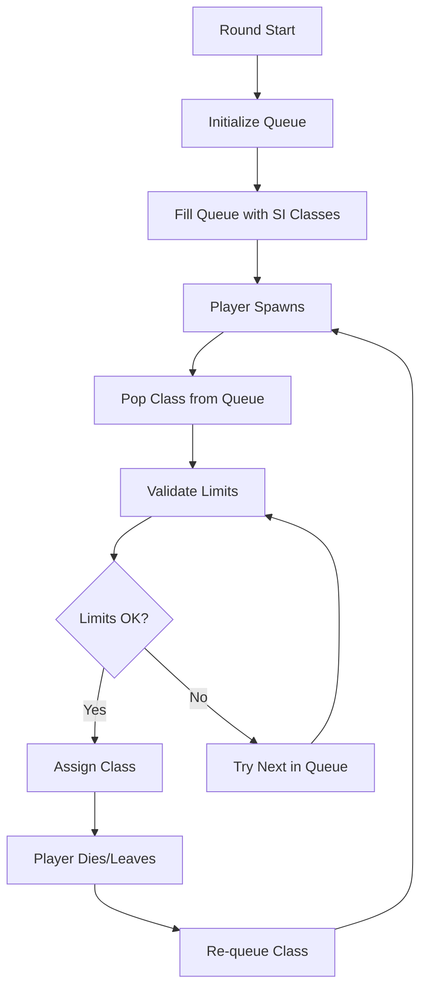

# L4D2 Fix Spawn Order Plugin

[](https://www.sourcemod.net/)
[](https://forums.alliedmods.net/showthread.php?t=321696)
[](LICENSE)
[](https://github.com/AoC-Gamers/L4D2-Fix-Spawn-Order/releases)

A comprehensive SourceMod plugin for Left 4 Dead 2 that ensures reliable and balanced Special Infected (SI) spawn rotation in competitive gameplay, solving the inherent unpredictability of the AI Director's spawn system.

## 🎯 Overview

The AI Director in Left 4 Dead 2 uses an unreliable spawn rotation system that can create unfair advantages in competitive scenarios. This plugin implements a **queue-based FIFO system with priority handling** to guarantee consistent and predictable SI spawns while respecting configured limits and dominator rules.

## 🏗️ Architecture

### Core Components

```
l4d2_fix_spawn_order.sp     # Main coordinator with logging system
├── fso_config.sp           # Configuration and state management  
├── fso_queue_limits.sp     # Queue operations and limit validation
├── fso_events.sp           # Player event handling and state tracking
└── fso_api.sp              # Native/forward API implementation
```

### System Flow



## 📋 Requirements

### Dependencies
- **SourceMod 1.11+** - Plugin framework
- **Left4DHooks** - L4D2 game integration and hooks
- **l4d2_dominatorscontrol.sp** *(recommended)* - For advanced dominator configuration

### Game Modes
- Versus
- Scavenge  
- Any mode with player-controlled infected

## 🚀 Installation

### Automatic Installation
1. Download the latest release from [Releases](https://github.com/AoC-Gamers/L4D2-Fix-Spawn-Order/releases)
2. Extract to your `addons/sourcemod/` directory
3. Restart the server or reload the plugin

### Manual Compilation
```bash
# Clone the repository
git clone https://github.com/AoC-Gamers/L4D2-Fix-Spawn-Order.git
cd l4d2-fix-spawn-order

# Compile with SourceMod compiler
spcomp -i"scripting/include" scripting/l4d2_fix_spawn_order.sp

# Install files
cp compiled/l4d2_fix_spawn_order.smx ../gameserver/addons/sourcemod/plugins/
cp scripting/include/fix_spawn_order.inc ../gameserver/addons/sourcemod/scripting/include/
```

### File Structure
```
addons/sourcemod/
├── plugins/
│   └── l4d2_fix_spawn_order.smx
├── scripting/
│   ├── l4d2_fix_spawn_order.sp
│   ├── fix_spawn_order/
│   │   ├── fso_config.sp
│   │   ├── fso_queue_limits.sp
│   │   ├── fso_events.sp
│   │   └── fso_api.sp
│   └── include/
│       └── fix_spawn_order.inc
```

## ⚙️ Configuration

### ConVars (Game Configuration)
```cfg
// Individual class limits (set by gamemode configs)
z_versus_smoker_limit "1"      // Maximum Smokers
z_versus_boomer_limit "1"      // Maximum Boomers  
z_versus_hunter_limit "1"      // Maximum Hunters
z_versus_spitter_limit "1"     // Maximum Spitters
z_versus_jockey_limit "1"      // Maximum Jockeys
z_versus_charger_limit "1"     // Maximum Chargers

// Dominator configuration (requires l4d2_dominatorscontrol)
l4d2_dominators "53"           // Bitmask: 53 = Smoker|Hunter|Jockey|Charger
```

### Dominator System
The plugin supports configurable dominator classes through a bitmask system:

| Class | Bit | Value | Description |
|-------|-----|-------|-------------|
| Smoker | 1 | 2 | Long-range disable |
| Boomer | 2 | 4 | AOE debuff |
| Hunter | 3 | 8 | High mobility damage |
| Spitter | 4 | 16 | Area denial |
| Jockey | 5 | 32 | Mobility control |
| Charger | 6 | 64 | Displacement damage |

**Default (53)**: Binary `110101` = Smoker(1) + Hunter(4) + Jockey(16) + Charger(32) = 53

## 🐛 Troubleshooting

### Common Issues

#### Empty Queue During Gameplay
```
Symptom: Players spawning as random classes
Cause: Queue exhausted without refill
Solution: Check limit configuration and dominator settings
```

#### Limit Exceeded Errors  
```
Symptom: "Dominator limit" or "Class limit" in logs
Cause: Configuration mismatch between static and dynamic limits
Solution: Verify gamemode config matches server settings
```

#### Tank Replacement Issues
```
Symptom: Players not getting proper classes after Tank
Cause: Tank replacement logic not handling class restoration
Solution: Update to latest version with improved Tank handling
```

### Debug Information
Enable debug logging to diagnose issues:
```cpp
// Set DEBUG flags to 1 and recompile
#define DEBUG 1
#define DEBUG_QUEUE 1     // For queue issues
#define DEBUG_LIMITS 1    // For limit problems  
#define DEBUG_EVENTS 1    // For player event issues
```

### Log Examples
```
[SO][Queue] Filled queue (Smoker, Hunter, Boomer, Spitter, Jockey, Charger)
[SO][Queue] Popped (Hunter) after 1 try
[SO][Limits] Popping (Smoker) but over limit (reason: Dominator limit)
[SO][Events] Player connected to infected team as (Hunter)
```

## 🤝 Contributing

### Development Setup
```bash
# Fork and clone
git clone https://github.com/AoC-Gamers/L4D2-Fix-Spawn-Order.git
cd l4d2-fix-spawn-order

# Create feature branch
git checkout -b feature/your-improvement

# Make changes and test
# Commit and push
git commit -m "Add your improvement"
git push origin feature/your-improvement

# Create Pull Request
```

### Code Standards
- Follow SourcePawn naming conventions
- Add comprehensive documentation for new functions
- Include debug logging for new features
- Maintain backward compatibility for API changes
- Add test cases for critical functionality

### Submitting Issues
Please include:
- L4D2 server version and platform
- SourceMod and plugin versions
- Gamemode and configuration details
- Console logs with debug enabled
- Steps to reproduce the issue

## 📄 License

This project is licensed under the **GNU General Public License v3.0** - see the [LICENSE](LICENSE) file for details.

### License Summary
- ✅ **Free to use, modify, and distribute**
- ✅ **Source code must remain open**
- ✅ **Commercial use allowed**
- ⚠️ **Derivative works must use same license**
- ⚠️ **No warranty provided**

## 🙏 Credits

### Original Development
- **Sir** - Original concept and implementation
- **Forgetest** - Core algorithm development and optimization
- **lechuga** - Modular refactoring and API design

### Community
- **AlliedModders** - SourceMod framework and community support
- **L4D2 Competitive Community** - Testing, feedback, and feature requests
- **SirPlease** - L4D2-Competitive-Rework project integration

## 📈 Changelog

### Version 4.5 (Current)
- ✅ Complete modular refactoring  
- ✅ Modern GlobalForward methodmap system
- ✅ Comprehensive API with 9 natives and 12 forwards
- ✅ Advanced debug logging with categorization
- ✅ Improved dominator system integration
- ✅ Enhanced player state tracking

### Version 4.4.3 (Legacy)
- ✅ Basic queue-based spawn ordering
- ✅ Simple limit validation
- ✅ Core dominator support

## 🔗 Related Projects

- **[L4D2-Competitive-Rework](https://github.com/SirPlease/L4D2-Competitive-Rework)** - Complete competitive L4D2 server package
- **[Left4DHooks](https://forums.alliedmods.net/showthread.php?t=321696)** - Essential L4D2 SourceMod extension
- **[l4d2_dominatorscontrol](https://github.com/SirPlease/L4D2-Competitive-Rework)** - Advanced dominator class configuration

---

*For support, feature requests, or bug reports, please [open an issue](https://github.com/AoC-Gamers/L4D2-Fix-Spawn-Order/issues)
