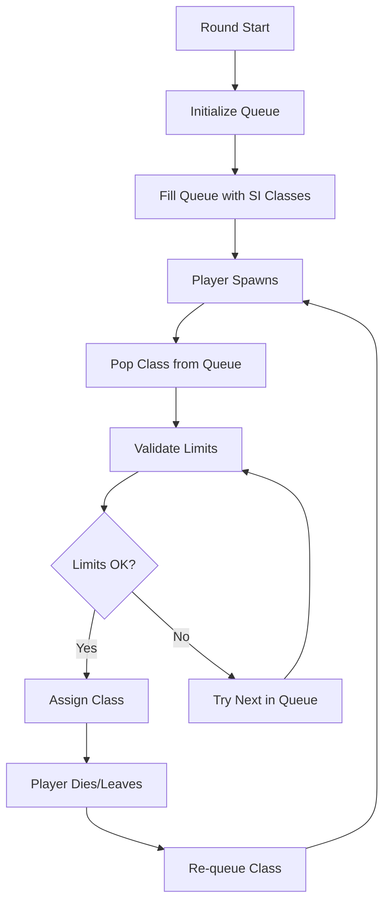

# L4D2 Fix Spawn Order Plugin

[](https://www.sourcemod.net/)
[](https://forums.alliedmods.net/showthread.php?t=321696)
[]

A comprehensive SourceMod plugin for Left 4 Dead 2 that ensures reliable and balanced Special Infected (SI) spawn rotation in competitive gameplay, solving the inherent unpredictability of the AI Director's spawn system.

## 🎯 Overview

The AI Director in Left 4 Dead 2 uses an unreliable spawn rotation system that can create unfair advantages in competitive scenarios. This plugin implements a **queue-based FIFO system with priority handling** to guarantee consistent and predictable SI spawns while respecting configured limits and dominator rules.

## 📋 Requirements

### Dependencies
- **SourceMod 1.11+** - Plugin framework
- **Left4DHooks** - L4D2 game integration and hooks
- **l4d2_dominatorscontrol.sp** *(recommended)* - For advanced dominator configuration

### Game Modes
- Versus
- Scavenge  
- Any mode with player-controlled infected

## 🚀 Installation

### Automatic Installation
1. Download the latest release from [Releases](https://github.com/AoC-Gamers/L4D2-Fix-Spawn-Order/releases)
2. Extract to your `addons/sourcemod/` directory
3. Restart the server or reload the plugin

### File Structure
```
addons/sourcemod/
├── plugins/
│   └── l4d2_fix_spawn_order.smx
├── scripting/
│   ├── l4d2_fix_spawn_order.sp
│   ├── fix_spawn_order/
│   │   ├── fso_config.sp
│   │   ├── fso_queue_limits.sp
│   │   ├── fso_events.sp
│   │   └── fso_api.sp
│   └── include/
│       └── fix_spawn_order.inc
```

## 🏆 Competitive L4D2 Spawn Mechanics (ZoneMod)

### Fixed Special Infected Rotation (Spawn Order)

In the competitive ZoneMod configuration of Left 4 Dead 2, the Special Infected spawn system is controlled and predictable. All playable Special Infected are numbered from 1 to 6 in a fixed order:

| Index | Class | Role |
|-------|-------|------|
| 1 | **Smoker** | Long-range grabber |
| 2 | **Boomer** | AOE debuffer |
| 3 | **Hunter** | High-mobility damage dealer |
| 4 | **Spitter** | Area denial |
| 5 | **Jockey** | Mobility controller |
| 6 | **Charger** | Displacement grabber |

#### How the Rotation Works

1. **Round Start**: The Director randomly selects four of these six classes for the "first hit" wave
2. **Queue Formation**: The remaining two classes are queued for later use, ordered by their numerical index
3. **Cyclical Selection**: If the Director starts from index 4 (Spitter), the first wave includes:
   - Spitter (4) → Jockey (5) → Charger (6) → Smoker (1)
4. **Death Re-queue**: When an SI dies, their class is added to the end of the queue
5. **Predictable Rotation**: The composition rotates in a fixed pattern that can be completely predicted by tracking death order

This logic is implemented in `l4d2_fix_spawn_order.sp`, which uses an internal queue to manage the SI sequence reliably.

### Quad-Caps: Four Simultaneous Grabbers

#### Default L4D2 Limitations

In normal gameplay, Left 4 Dead 2 restricts to a maximum of 3 "dominator" infected (those capable of incapacitating survivors: Smoker, Hunter, Jockey, Charger) simultaneously. The game engine marks these four classes as dominators and prevents more than three from spawning at once (any attempt to spawn a fourth would result in "OverLimit_Dominator").

#### ZoneMod Enhancement: Enabling Quad-Caps

ZoneMod allows the possibility of **"Quad-Cap"** - where all four spawns can be grabbing infected simultaneously (all four survivors could be trapped at once). This is achieved by modifying the internal limitation through the `l4d2_dominatorscontrol.sp` plugin.

**How it works:**

1. **Dominator Flag Control**: The plugin allows changing the `bIsDominator` flag for each SI class
2. **Bitmask Configuration**: Uses ConVar `l4d2_dominators` with a bitmask to indicate which classes count as dominators
   - **Default "53"**: Binary `110101` = Smoker(1) + Hunter(1) + Jockey(1) + Charger(1), excluding Boomer(0) and Spitter(0)
   - **Setting to "0"**: No class is treated as a dominator
3. **Memory Modification**: ZoneMod effectively uses this technique to eliminate the 3-grabber limit
4. **Individual Limits Preserved**: While respecting individual class limits (e.g., max 2 Hunters), the Director no longer blocks four-grabber combinations

**Result**: As the plugin author describes: *"Changes bIsDominator flag... Allows to have native-order quad-caps"* - enabling quad-caps in the native spawn order.

### Compatibility with Incomplete Teams (3v3 and Other Scenarios)

Competitive matches typically feature 4v4 gameplay, but ZoneMod also supports 3v3 modes and other incomplete team situations.

#### 3v3 Configuration Adjustments

For 3v3 matches, the official ZoneMod configuration makes the following adjustments:

```cfg
survivor_limit 3                // Only 3 survivors
z_max_player_zombies 3         // Only 3 infected per wave
z_versus_boomer_limit 0        // Disable Boomer
z_versus_spitter_limit 0       // Disable Spitter
```

**Rationale**: With one fewer infected, Boomer and Spitter are disabled to avoid "wasting" a slot on classes that cannot incapacitate survivors alone. This ensures that all three infected spawns are always grabbers (e.g., 1 Smoker, 1 Charger, 1 Hunter/Jockey), maintaining appropriate threat level with fewer players.

#### Dynamic Team Size Adaptation

The `l4d2_fix_spawn_order.sp` plugin includes special handling for these scenarios:

- **Automatic Detection**: The plugin automatically detects team size via `z_max_player_zombies.IntValue`
- **Queue Size Scaling**: Minimum queue size adapts to team composition
- **Initial Wave Adjustment**: When the infected team isn't full, the system reduces maximum simultaneous infected and redefines initial rotation
- **Invalid Combination Prevention**: Avoids invalid combinations or empty slots

**Code Implementation**:
```sourcepawn
// Dynamic team size calculation
int teamBasedQueueSize = z_max_player_zombies.IntValue / 2;
int minQueueSize = (teamBasedQueueSize > MIN_QUEUE_SIZE) ? teamBasedQueueSize : MIN_QUEUE_SIZE;
```

These improvements ensure spawn order compatibility even with reduced team sizes, maintaining the philosophy of balanced and predictable gameplay regardless of whether teams are complete or incomplete.

## 🏗️ Architecture

### Core Components

```
l4d2_fix_spawn_order.sp     # Main coordinator with logging system
├── fso_config.sp           # Configuration and state management  
├── fso_queue_limits.sp     # Queue operations and limit validation
├── fso_events.sp           # Player event handling and state tracking
└── fso_api.sp              # Native/forward API implementation
```

### System Flow



## ⚙️ Configuration

### ConVars (Game Configuration)
```cfg
// Individual class limits (set by gamemode configs)
z_versus_smoker_limit "1"      // Maximum Smokers
z_versus_boomer_limit "1"      // Maximum Boomers  
z_versus_hunter_limit "1"      // Maximum Hunters
z_versus_spitter_limit "1"     // Maximum Spitters
z_versus_jockey_limit "1"      // Maximum Jockeys
z_versus_charger_limit "1"     // Maximum Chargers

// Dominator configuration (requires l4d2_dominatorscontrol)
l4d2_dominators "53"           // Bitmask: 53 = Smoker|Hunter|Jockey|Charger
```

### Dominator System

The plugin supports configurable dominator classes through a bitmask system, enabling or disabling quad-cap functionality:

| Class | Bit Position | Binary Value | Decimal | Role in Quad-Caps |
|-------|-------------|--------------|---------|-------------------|
| Smoker | 1 | `000001` | 1 | Primary grabber |
| Boomer | 2 | `000010` | 2 | AOE debuff (non-grabber) |
| Hunter | 3 | `000100` | 4 | High-mobility grabber |
| Spitter | 4 | `001000` | 8 | Area denial (non-grabber) |
| Jockey | 5 | `010000` | 16 | Mobility grabber |
| Charger | 6 | `100000` | 32 | Displacement grabber |

#### Dominator Configuration Examples

```cfg
// Standard ZoneMod (allows quad-caps)
l4d2_dominators "53"    // Binary: 110101 = Smoker + Hunter + Jockey + Charger
                        // Result: 1+4+16+32 = 53 (4 grabbers as dominators)

// Disable quad-caps (vanilla L4D2 behavior)  
l4d2_dominators "53"    // Keep dominators, max 3 simultaneous
// + ensure l4d2_dominatorscontrol enforces limits

// No dominator limits (experimental)
l4d2_dominators "0"     // Binary: 000000 = No classes as dominators
                        // Result: Unlimited grabbers (not recommended)

// 3v3 Configuration (grabbers only)
l4d2_dominators "53"    // Same bitmask
z_versus_boomer_limit "0"   // Disable non-grabbers
z_versus_spitter_limit "0"  // Force grabber-only spawns
```

#### Understanding the Bitmask Calculation

To create a custom dominator configuration:

1. **Choose desired dominator classes**
2. **Add their decimal values**:
   - Smoker + Hunter + Jockey = 1 + 4 + 16 = **21**
   - All grabbers = 1 + 4 + 16 + 32 = **53** (ZoneMod default)
   - All classes = 1 + 2 + 4 + 8 + 16 + 32 = **63**

**Pro Tip**: Use binary representation to visualize: `53 = 110101` shows positions 1,3,5,6 are set (Smoker, Hunter, Jockey, Charger).

## 🎮 Administrative Commands

The plugin provides several administrative commands for managing spawn behavior and safe area control:

### Safe Area Control Commands

```cfg
// Force survivors to be considered as having left safe area
sm_fso_force_safearea_exit

// Reset safe area status (disable bot spawning)  
sm_fso_reset_safearea

// Check current safe area status
sm_fso_check_safearea
```

#### Safe Area Spawn Control

By default, the plugin prevents infected bots from spawning until survivors leave the safe area. This prevents immediate bot spawns at round start and ensures proper game flow.

**Command Examples:**
```
// Admin forces early bot spawning
] sm_fso_force_safearea_exit
[FSO] Safe area status set to: Left (Bot spawning enabled)

// Admin disables bot spawning temporarily
] sm_fso_reset_safearea  
[FSO] Safe area status set to: In Safe Area (Bot spawning disabled)

// Check current status
] sm_fso_check_safearea
[FSO] Safe Area Status:
  Plugin tracking: Left
  Game state: Left
  Bot spawning: Enabled
```

#### Status Monitoring

The plugin continuously monitors safe area status and provides detailed logging:

```
[SO][Events] Round started - Survivors left safe area: Yes
[SO][Events] First survivor PlayerName left safe area - Bot spawning now enabled
[SO][Events] Admin PlayerName forced safe area exit - Bot spawning enabled
```

## 🧪 Testing & Validation

### Recommended Test Scenarios

1. **Different Game Modes**:
   - 4v4 Versus (standard competitive)
   - 3v3 Versus (reduced team size)
   - 8v8 modes (if supported)

2. **Dominator Configurations**:
   - Standard ZoneMod (`l4d2_dominators "53"`) - Verify quad-caps work
   - Vanilla L4D2 (`l4d2_dominators "53"` with limit enforcement) - Max 3 grabbers
   - Custom configurations - Test specific class combinations

3. **Edge Cases**:
   - Player disconnections during spawns
   - Tank replacement scenarios  
   - Rapid rebalances and limit changes
   - Safe area admin command interactions

4. **Performance Testing**:
   - Multiple consecutive rounds
   - High player turnover scenarios
   - Debug logging overhead verification

### Using the Test Plugin

Deploy `l4d2_fix_spawn_order_test.sp` alongside the main plugin and use the available commands to test quad-cap functionality and other features. Monitor test results in chat and console logs for verification.

### API Testing Commands (Test Plugin)

When using the companion test plugin (`l4d2_fix_spawn_order_test.sp`):

```cfg
// Start comprehensive API testing
sm_fso_test_start

// Stop continuous testing
sm_fso_test_stop

// Test specific components
sm_fso_test_natives      // Test all native functions
sm_fso_test_queue        // Test queue operations
sm_fso_test_players      // Test player operations  
sm_fso_test_state        // Test game state
sm_fso_test_safearea     // Test safe area functionality
sm_fso_test_all          // Run complete test suite
```

## 🐛 Troubleshooting

### Common Issues

#### Empty Queue During Gameplay
```
Symptom: Players spawning as random classes
Cause: Queue exhausted without refill
Solution: Check limit configuration and dominator settings
```

#### Limit Exceeded Errors  
```
Symptom: "Dominator limit" or "Class limit" in logs
Cause: Configuration mismatch between static and dynamic limits
Solution: Verify gamemode config matches server settings
```

#### Tank Replacement Issues
```
Symptom: Players not getting proper classes after Tank
Cause: Tank replacement logic not handling class restoration
Solution: Update to latest version with improved Tank handling
```

### Debug Information
Enable debug logging to diagnose issues:
```cpp
// Set DEBUG flags to 1 and recompile
#define DEBUG 1
#define DEBUG_QUEUE 1     // For queue issues
#define DEBUG_LIMITS 1    // For limit problems  
#define DEBUG_EVENTS 1    // For player event issues
```

### Log Examples
```
[SO][Queue] Filled queue (Smoker, Hunter, Boomer, Spitter, Jockey, Charger)
[SO][Queue] Popped (Hunter) after 1 try
[SO][Limits] Popping (Smoker) but over limit (reason: Dominator limit)
[SO][Events] Player connected to infected team as (Hunter)
```
## 🙏 Credits

### Original Development
- **Sir** - Original concept and implementation
- **Forgetest** - Core algorithm development and optimization
- **lechuga** - Modular refactoring and API design

### Community
- **AlliedModders** - SourceMod framework and community support
- **L4D2 Competitive Community** - Testing, feedback, and feature requests
- **SirPlease** - L4D2-Competitive-Rework project integration

## 📈 Changelog

### Version 4.5 (Current) - Major Rework
#### 🏗️ **Core System Improvements**
- ✅ **Complete modular refactoring** - Separated into logical components
- ✅ **Fixed IsDominator function** - Corrected bitmask evaluation for proper quad-caps
- ✅ **Dynamic team size adaptation** - Automatically scales to 3v3, 4v4, and other configurations
- ✅ **Initialization order correction** - Config → Queue → API for reliable startup

#### 📊 **Enhanced Monitoring**
- ✅ **Detailed queue composition logging** - Shows "2xSmoker, 1xHunter, 1xCharger" format
- ✅ **Improved configuration reporting** - "Infected: 2 humans + 2 bots = 4/8"
- ✅ **Administrative commands** - Safe area control and status checking
- ✅ **Comprehensive test suite** - API testing plugin with 8 test categories

#### 🔧 **Technical Enhancements**
- ✅ **Modern GlobalForward methodmap system** - Future-proof API design
- ✅ **9 natives and 12 forwards** - Complete API coverage for integration
- ✅ **Categorized debug logging** - Queue, Limits, Events, Rebalance categories
- ✅ **Memory optimization** - Efficient string handling and reduced allocations

### Version 4.4.3 (Legacy)
- ✅ Basic queue-based spawn ordering
- ✅ Simple limit validation
- ✅ Core dominator support

## � References & Documentation

- **[ZoneMod Documentation](https://github.com/SirPlease/L4D2-Competitive-Rework)** - Official competitive configuration
- **[L4D2 SI Class Reference](https://developer.valvesoftware.com/wiki/Left_4_Dead_2)** - Valve's official class documentation
- **[SourceMod API Documentation](https://sm.alliedmods.net/new-api/)** - Plugin development reference
- **[Competitive L4D2 Community Wiki](https://github.com/SirPlease/L4D2-Competitive-Rework/wiki)** - Community knowledge base

## �🔗 Related Projects

- **[L4D2-Competitive-Rework](https://github.com/SirPlease/L4D2-Competitive-Rework)** - Complete competitive L4D2 server package including ZoneMod
- **[Left4DHooks](https://forums.alliedmods.net/showthread.php?t=321696)** - Essential L4D2 SourceMod extension for game integration
- **[l4d2_dominatorscontrol](https://github.com/SirPlease/L4D2-Competitive-Rework)** - Advanced dominator class configuration for quad-caps